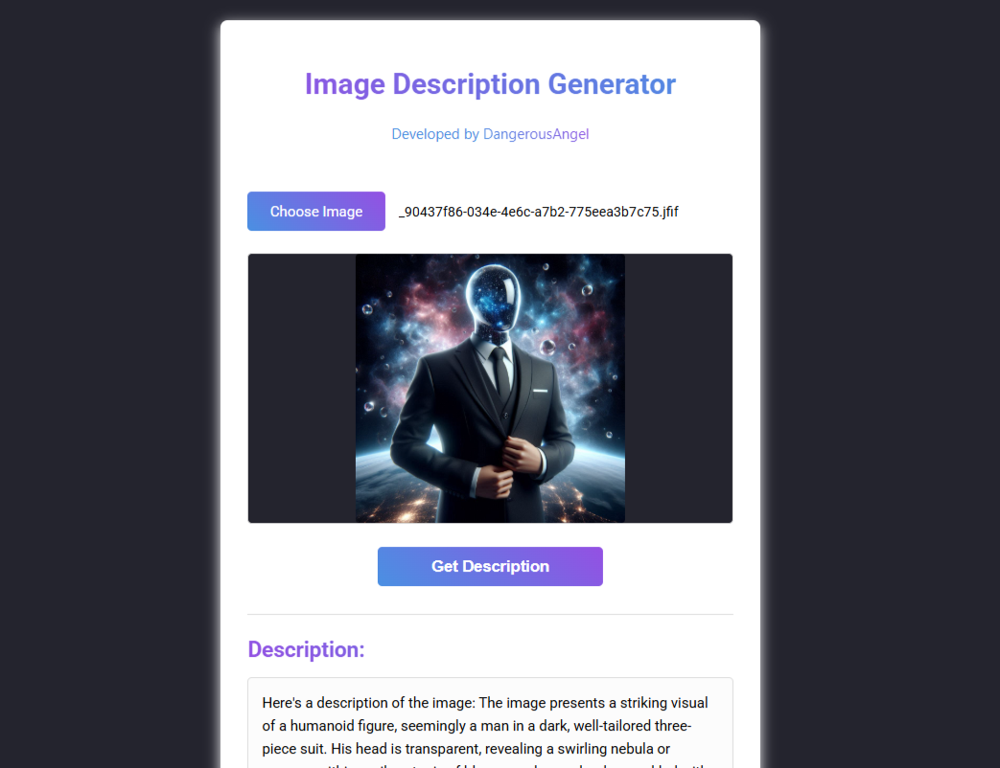

# Image Description Generator

A simple web application that generates descriptions for uploaded images.

## Features

- Upload any image file (JPG, PNG, etc.)
- Get the description for the image (functionality to be implemented in script.js)

## How to Use

1. Open `index.html`
2. Click "Choose Image" to select an image file
3. Click "Get Description" and then you need to enter your API
4. Open [aistudio](https://aistudio.google.com/) to get your own API

## Developer

Developed by [DangerousAngel](https://linktr.ee/DangerousAngel)
